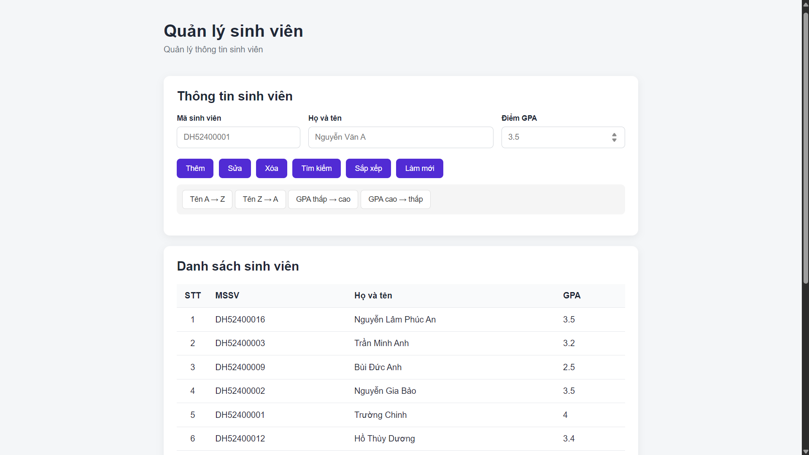

# Web quản lý thông tin sinh viên nhỏ

Chương trình quản lý sinh viên trên Website dùng frameword ASP.NET làm backend mô phỏng chức năng quản lý sinh viên có giao diện với các tính năng như thêm, xóa, sửa, sắp xếp và thống kê thông tin sinh viên. Chương trình chỉ mang tính chất mô phỏng chưa đầy đủ tính chất phân quyền/bảo mật,... Chỉ dùng cho mục đích tham khảo nghiên cứu và học tập.

<!-- ảnh demo website -->


---

### Biên dịch và khởi chạy
```bash
git clone https://github.com/trgchinhh/student-managemet-asp.net.git
cd ./student-managemet-asp.net
dotnet run 
```
---

## Tác giả
**Nguyễn Trường Chinh (NTC++)**<br>
**GitHub:** [https://github.com/trgchinhh](https://github.com/trgchinhh)

---

> 📌 Dự án nhỏ được phát triển với mục đích học tập và nghiên cứu. Mọi góp ý và đóng góp đều được hoan nghênh. 